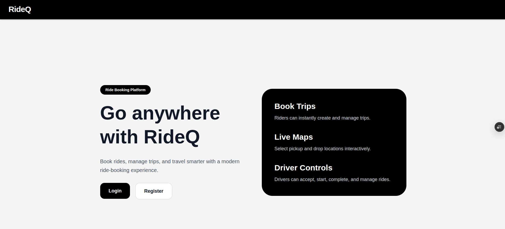
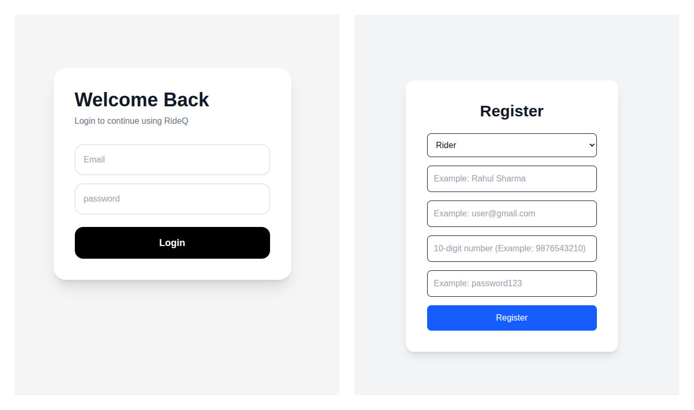
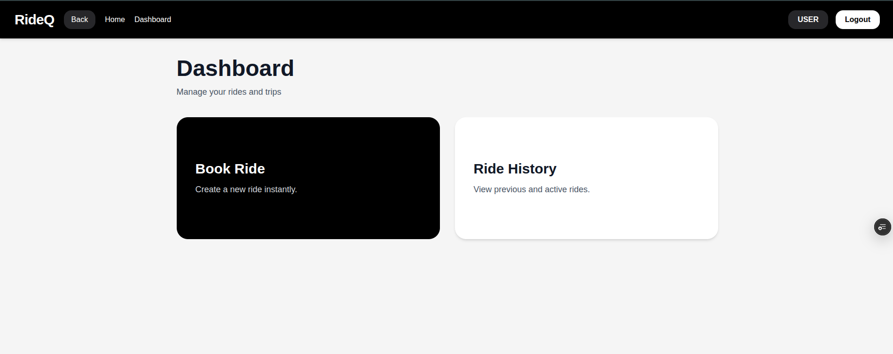
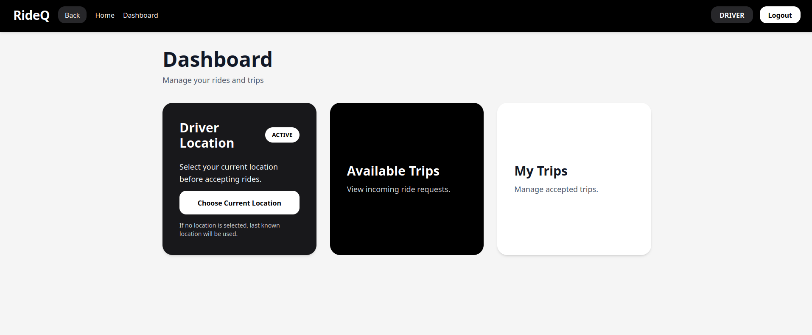
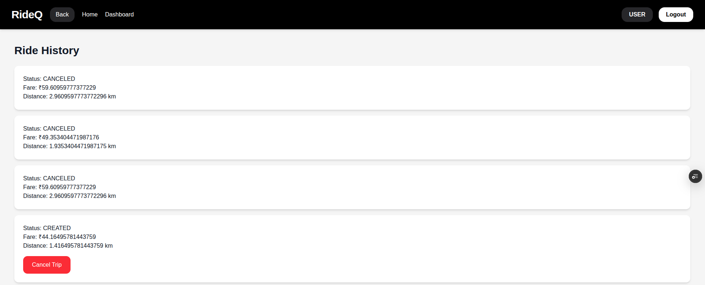
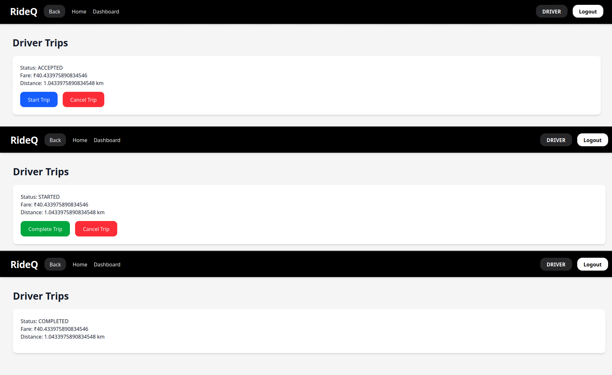

# RideQ — Full Stack Ride Booking Application

RideQ is a full stack ride booking application inspired by platforms like Uber.  
I built this project to understand how ride booking systems actually work behind the scenes from authentication and ride requests to driver assignment, trip handling, and frontend-backend communication.

The idea was not just to create another booking UI, but to build the complete flow of a ride in a way that feels closer to a real system. Riders can book trips using live maps, drivers can manage ride requests, and the backend handles everything from authentication to ride state management and driver matching.

---

# 🚀 Live Project

### Live Demo
if you want to see Deployed end result click here

->      [RideQ Live Demo](https://rideq.vercel.app)


# About The Project

RideQ focuses on the actual workflow behind a ride booking platform.

The project includes:

- Secure authentication for riders and drivers
- Role-based access control
- Live map-based location selection
- Trip lifecycle handling
- Nearest driver assignment
- Ride acceptance/rejection flow
- Ride history tracking
- Persistent data storage using PostgreSQL
- Deployed frontend and backend services

One of the main things I wanted to focus on was how different parts of the system connect together the frontend, APIs, authentication, database, ride logic, and driver workflows, instead of treating the project as isolated pages or endpoints.

---

# Features

## 👤 Rider Features

- Register and login securely
- Book rides using interactive maps
- Select pickup and drop locations
- View ride history and trip details
- Cancel rides before completion
- Track trip status updates

## 🚗 Driver Features

- Register as a driver
- Set current location on the map
- Go online/offline
- Accept or reject ride requests
- Start and complete trips
- Manage active rides

## ⚙️ Backend Features

- JWT-based authentication & authorization
- Role-based protected APIs
- Trip lifecycle management
- Distance-based driver matching
- Automatic reassignment when rides are rejected
- RESTful API architecture
- PostgreSQL database integration
- Event-driven ride assignment flow

---

# 🗺️ Maps & Location Handling

RideQ uses Leaflet.js with OpenStreetMap for location handling.

Riders can select pickup and drop points directly from the map, while drivers can update their current location before accepting trips.

The backend uses these coordinates to:

- Calculate trip distance
- Estimate fares
- Find the nearest available drivers

---

# 🛠️ Tech Stack

## Backend

- Java 21
- Spring Boot
- Spring Security
- JWT Authentication
- Hibernate / JPA
- PostgreSQL
- Maven
- Docker

## Frontend

- React
- React Router
- Axios
- Tailwind CSS
- Leaflet.js
- OpenStreetMap

---

# How RideQ Works

```text
User books a ride
        ↓
Trip gets created
        ↓
System searches for nearby available drivers
        ↓
Driver accepts or rejects the request
        ↓
If rejected, another driver is assigned
        ↓
Trip progresses through different stages
        ↓
Frontend keeps updating ride status
```

Trip lifecycle:

```text
CREATED → ASSIGNED → ACCEPTED → STARTED → COMPLETED
```

Trips can also be cancelled before completion.

---

# 📸 Screenshots

## Home Page


---

## Login & Registration


---

## Rider Dashboard

---

## Driver Dashboard


---

## Ride Booking & Map View


---

## Rider Trip History 

---
## Active Trip Flow(Driver)


---

# Future Improvements

Some things I would like to add in the future:

- WebSocket-based real-time updates
- Live driver tracking
- Payment integration
- Notifications system
- Better ride matching algorithms
- Microservices architecture

---

# 👨‍💻 Author

**Prajwal Kavishwar**  
B.Tech Mathematics and Computing Engineering Student

---

If you found the project interesting, feel free to give it a ⭐ on GitHub.